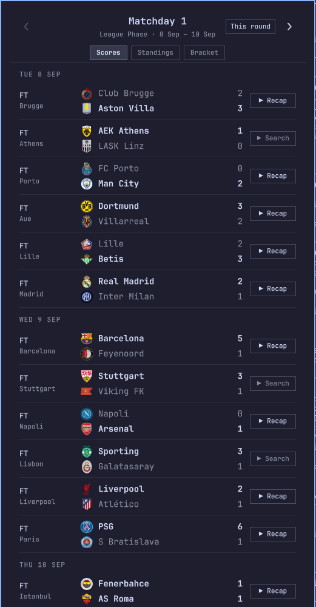
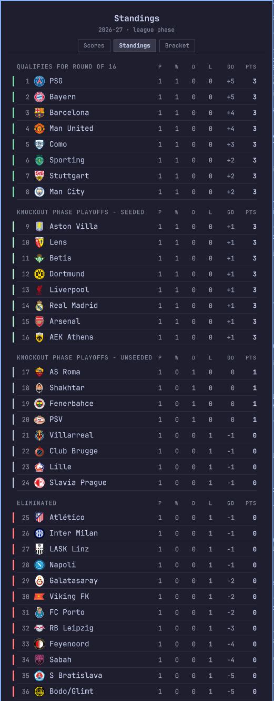
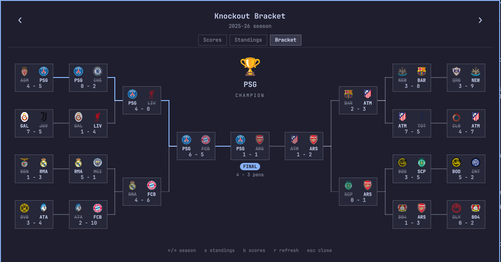

# Champions League

[](LICENSE)

Champions League is a bar widget for the [Omarchy](https://omarchy.org) shell. The bar shows the current round of the UEFA Champions League and the number of games that are live right now. A click on the widget opens a panel with the scores and the fixtures of every game in the round, and you can step through every round of the season, from Matchday 1 to the Final. The panel also has a standings view with the league phase table, and a bracket view with the whole knockout phase as a tree. The data comes from ESPN's public scoreboard, which does not need an API key.

| Scores and fixtures | Standings |
| :---: | :---: |
|  |  |

<p align="center">
  
</p>

## Contents

- [Features](#features)
- [Requirements](#requirements)
- [Installation](#installation)
- [Usage](#usage)
- [Bracket](#bracket)
- [Recaps](#recaps)
- [IPC](#ipc)
- [Theming](#theming)
- [How it works](#how-it-works)
- [Troubleshooting](#troubleshooting)
- [Disclaimer](#disclaimer)
- [License](#license)

## Features

- The bar shows `⚽ MD2`, plus `● 3` in the active color while three games are live
- A panel with every game of the round: kickoff time in your timezone, the city, the score with the live minute or `FT`/`AET`, and the penalty shootout score
- Second legs show the aggregate score of the tie
- Live games refresh every 30 seconds, and everything else every 5 minutes
- Step through the whole season: the eight matchdays of the league phase, the two legs of the knockout playoffs, the round of 16, the quarter-finals and the semi-finals, and the final. Knockout rounds appear as soon as ESPN publishes them
- A knockout bracket, drawn as the classic mirrored tree: the knockout playoffs, the round of 16, the quarter-finals and the semi-finals on each side, and the final in the middle. Each tie shows the logos, the codes, and the aggregate score, the team that went out is struck through, and the path of the champion is highlighted. Step back to the bracket of earlier seasons with `←`. Click on a tie of the current season to open its games
- Standings of the league phase for the 36 teams, in the four zones of the format (round of 16, seeded playoffs, unseeded playoffs, eliminated), with played, won, drawn, lost, goal difference and points
- A **Recap** button on finished games that opens the official YouTube highlights, and a **Search** button that opens YouTube results for the games that have none. See [Recaps](#recaps)
- Keyboard control, and an IPC interface for keybinds and scripts
- Follows your Omarchy theme and bar font
- No API key, and no account

## Requirements

- [Omarchy](https://omarchy.org) with the shell plugin system
- `curl`, to fetch the scores
- (Optional) [`yt-dlp`](https://github.com/yt-dlp/yt-dlp) and `python3`, to find the highlights videos behind the **Recap** button. Without them the buttons do not appear, and the rest of the plugin works the same.

## Installation

```bash
omarchy plugin add https://github.com/Onra/omarchy-ucl-scores.git --enable
```

That clones the repository into `~/.config/omarchy/plugins/onra.ucl-scores`, validates the manifest, and enables the widget. To update or remove it later:

```bash
omarchy plugin update onra.ucl-scores
omarchy plugin remove onra.ucl-scores
```

The widget belongs to the `center` section of the bar by default. To place it somewhere else, set its position in the bar layout in `~/.config/omarchy/shell.json`:

```json
{
  "bar": {
    "layout": {
      "right": [
        { "id": "onra.ucl-scores" }
      ]
    }
  }
}
```

> [!IMPORTANT]
> The shell compiles QML when it starts. After you install the plugin, or edit one of its files, run `omarchy restart shell` to see the result.

## Usage

| Action | Result |
|---|---|
| Click on the bar widget | Open or close the panel |
| Middle-click on the bar widget | Refresh the scores now |
| `←` / `→` | Previous or next round (scores view), or previous or next season (bracket view) |
| `↑` / `↓` | Scroll the list |
| `t` | Jump back to the round that is current |
| `s` | Switch between the scores and the standings |
| `b` | Switch between the scores and the bracket |
| `r` | Refresh |
| `Esc` | Close the panel |

The header of the panel has the same controls as buttons: the arrows step through the rounds, a **This round** button appears when you look at another round, and the **Scores**, **Standings** and **Bracket** tabs switch the view. The panel always opens on the scores of the current round. In the bracket view the panel gets wider, and it shrinks the tree by itself on a narrow screen.

The current round is the one that is being played. Once a round is over its results stay up for three days, and then the panel moves on to the next fixtures. When the bar is vertical, the widget shows the ⚽ glyph alone.

## Bracket

The bracket has the same shape as the one that UEFA publishes: the eight knockout playoff ties on the outside, then the round of 16, the quarter-finals and the semi-finals, and the final and the trophy in the middle. A tie is shown as it is decided: the first leg alone shows a partial aggregate, a tie that is being played has a colored border, and a finished tie strikes through the team that went out. A place that ESPN has not filled yet is an empty box, so this season's bracket starts empty and fills in from the draw of the knockout playoffs to the final.

The bracket of a past season is fetched once, when you step back to it with `←`. The first season with this format is 2024-25. The codes on the cards are the UEFA-style codes (`FCB`, `MCI`, `BVB`) and not the ones that ESPN uses for some clubs.

## Recaps

For a finished game the panel shows one of two buttons:

- **▶ Recap** opens a YouTube video of the highlights of that game.
- **▶ Search** opens the YouTube results for that game, when no video was found.

Unlike a league with one broadcaster, the Champions League has no YouTube channel that posts the highlights of every game, and a plain search returns many re-uploads, PES simulations, and videos of another game with a similar title. So the plugin only accepts a video that passes all these checks:

- it comes from the official channel of one of the two clubs (`Man City`, `FC Barcelona`, `Arsenal`, …), or from a known broadcaster
- the title says highlights, and names both teams
- a score in the title is the score of the game
- it was uploaded within two months after the game

In practice most games have a video, and the clubs that do not upload highlights (or that name their videos in an unexpected way) get the **Search** button. The answers are kept in `~/.cache/onra-ucl-scores/recaps.json`. A video that is found stays in the cache. A game with no video is searched again after 30 minutes on the days after the game, because clubs post the highlights some hours later, and after 12 hours for older games.

## IPC

The plugin answers the shell's IPC on the target `onra.ucl-scores`, so a keybind or a script can drive it without the mouse:

```bash
omarchy-shell onra.ucl-scores toggle
```

| Function | Description |
|---|---|
| `open`, `show` | Open the panel |
| `close`, `hide` | Close the panel |
| `toggle` | Open or close the panel |
| `next`, `prev` | Step to the next or the previous round (or season, in the bracket) |
| `today` | Show the scores of the current round |
| `scores` | Switch to the scores |
| `standings` | Switch to the standings |
| `bracket` | Switch to the bracket |
| `refresh` | Fetch now |

For example, this line in `~/.config/hypr/bindings.lua` opens the panel on a key:

```lua
o.bind("SUPER + ALT + C", "Champions League", "omarchy-shell onra.ucl-scores toggle")
```

## Theming

The panel takes the colors and the font from the shell, so it follows the Omarchy theme that is active, and it changes when you change the theme. The team logos come from ESPN. The color bars in the standings are the qualification colors of ESPN.

## How it works

1. `Fetcher.qml` calls the ESPN scoreboard API with `curl`. One request returns a whole calendar year, and a season runs from September to May, so the season is fetched as two requests, one per year. Today's games are fetched on their own, which is what the live polling uses.
2. ESPN has no matchday or leg numbers, and no bracket. `Model.js` builds the rounds from the phase of each game and from its kickoff time: the games of a phase that are less than three days apart belong to the same round. That gives Matchday 1 to 8, and the two legs of each knockout tie. It also picks the current round, and turns the JSON of ESPN into the rows that the panel draws.
3. The bracket is built by `Model.js` from the same games. It groups the games of a phase by the pair of teams into ties, adds the legs into an aggregate, reads who advances from ESPN's flag on the last leg, and then puts every tie next to the tie it came from: the tie of the team that goes on to the next round. `Bracket.qml` and `BracketCard.qml` draw the result.
4. `Panel.qml` owns the fetchers and the refresh timers, so the label of the bar stays current while the panel is closed. The standings are fetched when you look at them.
5. For finished games, `recap.py` looks for the highlights on YouTube with `yt-dlp`, and applies the checks of [Recaps](#recaps).

## Troubleshooting

| Symptom | Cause | Fix |
|---|---|---|
| The bar shows `⚽ UCL` and it stays dim | The first fetch failed, or is not finished | Check the network, then middle-click the widget to fetch again |
| The panel does not change after you edit a file | The shell holds QML in its cache | Run `omarchy restart shell` |
| No **Recap** or **Search** button on a finished game | `yt-dlp` is not installed, or the search is not finished | Install `yt-dlp`, and wait a few seconds after you open the round |
| **Search** on a game that has a video on YouTube | The club does not upload its highlights, or its title does not name both teams | Use the search, or open the video from there |
| The buttons open nothing | No default application for links | Set a browser as the default with `xdg-settings` |
| A knockout round is missing, or the bracket is empty | ESPN has not published its fixtures yet | Wait for the draw. The round and the bracket fill in by themselves |
| The bracket of a past season stays empty | The fetch failed | Step to another season and back |
| The scores are old | A fetch failed, and the panel shows the last data it has | Press `r` in the panel to fetch again |

## Disclaimer

This is an unofficial project. It is not affiliated with, or endorsed by, UEFA or ESPN. The team names and logos are trademarks of their owners. The plugin reads ESPN's public web endpoints, which have no promise of stability, so a change on their side can break the plugin.

## License

[MIT](LICENSE)
